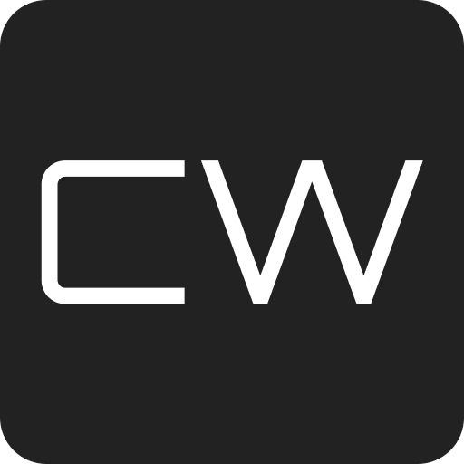

<div>
  
</div>

<h1>Cybertruck Wraps</h1>

<a href="https://cybertruckwraps.io" target="_blank">cybertruckwraps.io</a>

<p>Cybertruck Wraps is a website that allows people to easily share their custom digital cybertruck wraps for other people to download</p>

<hr />

<h3>Background:</h3>
<p>Tesla's Holiday Update (2024) added the ability for Cybertruck owners to add a custom digital wrap on their infotainment screen. A png image needs to be downloaded that complies with certain requirements related to size and name of the file, which can then be transferred to the specific directory on the TSLADRIVE USB. This will then appear on the Cybertruck's infotainment screen.</p>

<hr />

<h3>Stack:</h3>
<ul>
    <li>Next.js</li>
    <li>Typescript</li>
    <li>Tailwind CSS</li>
    <li>MongoDB</li>
    <li>Cloudinary</li>
    <li>Google OAuth</li>
</ul>

<hr />

<h2>Contributing Guidelines</h2>
<p>To contribute to the project, create your own branch for each feature. Once you are done, create a pull request into the <code>preview</code> branch. The code owners will then merge into <code>preview</code> when appropriate, which will then trigger an automatic testing deployment. The preview branch contains all the code in testing for the next version. Once everything is tested and complete, it will eventually be merged into <code>main</code>, which automatically gets deployed into production.</p>

<h2>Running the Project</h2>

```bash
npm run dev
# or
yarn dev
# or
pnpm dev
# or
bun dev
```

Open [http://localhost:3000](http://localhost:3000) with your browser to see the result.

You can start editing the page by modifying `app/page.tsx`. The page auto-updates as you edit the file.

This project uses [`next/font`](https://nextjs.org/docs/app/building-your-application/optimizing/fonts) to automatically optimize and load [Geist](https://vercel.com/font), a new font family for Vercel.

## Learn More

To learn more about Next.js, take a look at the following resources:

- [Next.js Documentation](https://nextjs.org/docs) - learn about Next.js features and API.
- [Learn Next.js](https://nextjs.org/learn) - an interactive Next.js tutorial.

You can check out [the Next.js GitHub repository](https://github.com/vercel/next.js) - your feedback and contributions are welcome!

## Deploy on Vercel

The easiest way to deploy your Next.js app is to use the [Vercel Platform](https://vercel.com/new?utm_medium=default-template&filter=next.js&utm_source=create-next-app&utm_campaign=create-next-app-readme) from the creators of Next.js.

Check out our [Next.js deployment documentation](https://nextjs.org/docs/app/building-your-application/deploying) for more details.
